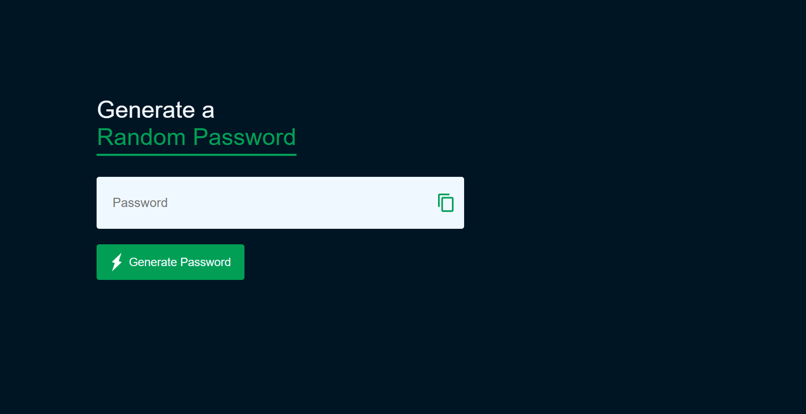
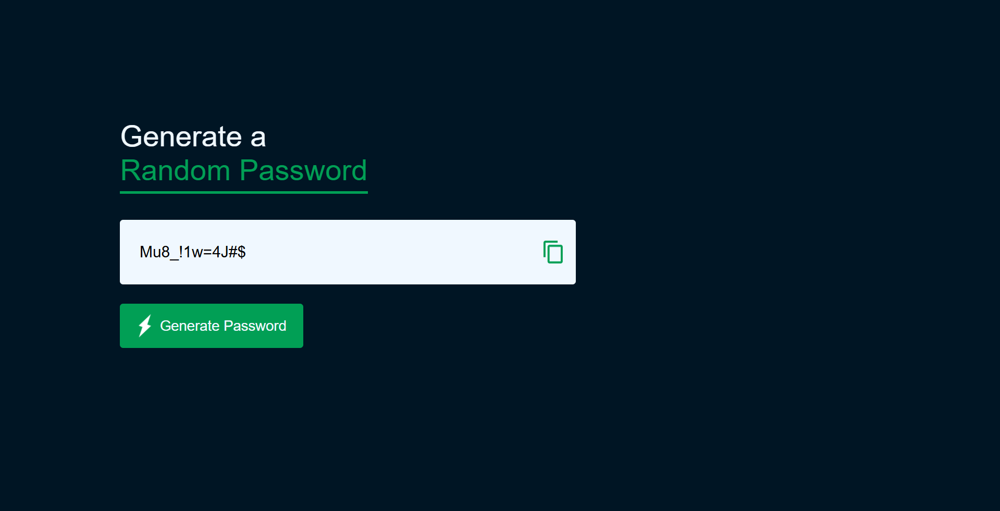

# Generate a Random Password

## Overview
This project generates secure, random passwords that combine various character types (uppercase, lowercase, numbers, and special characters). It provides an easy way to create passwords with specific lengths and custom character sets to improve security.

## Features
- **Random password generation**: Creates passwords that are strong and hard to guess.
- **Customizable length**: Allows you to choose the desired password length.
- **Flexible character set**: Includes options to include/exclude uppercase, lowercase, numbers, and special characters.

## Motivation
Creating secure passwords is essential for personal and data security. This tool helps users generate random, strong passwords to enhance security practices and protect online accounts.

